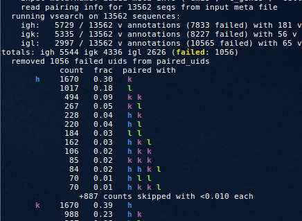

[Up to table of contents](contents.md)

  - [overview](#overview)
  - [output directory](#output-directory)
  - [pair cleaning](#pair-cleaning)
  - [approximate bulk pairing](#approximate-bulk-pairing)
  - [choosing antibodies](#choosing-antibodies)
  - [simulation](#simulation)

### overview

By default partis assumes each input file contains sequences from only a single locus, specified with `--species` and `--locus`.
In order to run on multiple loci, you must set the `--paired-loci` option.
This also allows the incorporation of heavy/light pairing info, for instance from 10x single cell data, which will dramatically improve partitioning performance.

A simple invocation would be:
```
partis partition --infname <fasta-input-file> --paired-loci --paired-outdir <output-dir>
```
As usual, this will first cache parameters if they don't exist; also as usual, if you want to use more advanced parameter caching options, it's best to run the `cache-parameters` step by hand.
If this is indeed 10x single cell data, partis will automatically extract the droplet id from each sequence id in your input file, and use this to write pairing info to a json/yaml file (which it'll pass internally with `--input-metafnames`).
With current 10x conventions, this means that sequence ids look like "AAACGGGCAAGCGAGT-1_contig_2", and all sequences with the same bit before the first "-" are from the same droplet.
You can also run the pairing info extraction by hand (for instance if 10x changes their naming conventions) with `bin/extract-pairing-info.py <10x-fasta-input-file> <meta-info-file>`, then pass the resulting `--input-metafnames` to partis.
Both this extraction script and `bin/partis` take the arguments `--droplet-id-separators` and `--droplet-id-indices` to provide some customization as to which bits of the sequence id specify the droplet id.
Alternatively, you can pass in your own pairing info with the `paired-uids` key in `--input-metafnames` as described [here](subcommands.md#input-meta-info).

Partis will then use `bin/split-loci.py` to split the input fasta file into separate files for each locus, and run on those individually.
Everything of potential future use (including parameters) is written to `--paired-outdir`.
After partitioning each locus individually, it uses pairing information to merge these single-chain partitions into "joint"/"paired" partitions.
This involves, for example, splitting clusters from one chain whose component sequences' paired sequences have different cdr3 lengths (in the other chain).
You can also run the merging step by itself on existing partition output with the `merge-paired-partitions` action.

Here are a sampling of options related to paired results:

| option                   | description
|--------------------------|-----------------------------------------------------------------
| `--existing-output-run-cfg <cfg>` | A variety of actions (e.g. `get-selection-metrics`, `plot-partitions`) run on existing partition output. With paired clustering, there's several different partition outputs that we can run them on: single-chain intermediate results, paired results (in h+<l> subdirs), merged igh results, and "fake-paired" results (from smooshing h+l seqs together). This option configures which of these we run on (see --help for details).
| `--add-unpaired-seqs-to-fake-paired-annotations` | When making the h+l "fake paired" annotation (i.e. smashing h+l seqs together) for use in selection metrics and/or partition plotting, by default we ignore unpaired seqs. This option includes them, with Ns for the missing opposite-chain sequence
| `--keep-all-unpaired-seqs` | By default when paired clustering, seqs with no pair info are kept only if they\'re in a (single-chain) family with at least one paired seq (i.e. families consisting entirely of unpaired seqs are discarded). If this is set, instead we keep all unpaired seqs.

### output directory

The files in `--paired-outdir` are arranged in a standardized way, although not all actions create or use all files.
The paired info (and any other info for `--input-metafnames`) will be in `meta.yaml`.
Assuming that `bin/split-loci.py` has been run (either automatically by partis, or by hand), the top-level dir will have three fasta files `ig{h,k,l}.fa` with all sequences for each locus, as well as `failed.fa` for any that could not be assigned.
There is a directory `parameters/` with subdirs for each locus.
The single-chain partitions for each locus are in `single-chain/partition-ig{h,k,l}.yaml`.
If pairing info was available, there will be subdirs `igh+igk/` and `igh+igl/` so that heavy chain sequences can be further split into those pairing with each light chain, so with `ig{h,k}.fa` and `ig{h,l}.fa`.
The joint/merged partitions are also written to these paired subdirs.
Finally, the joint/merged heavy chain partitions from both paired subdirs are concatenated into `partition-igh.yaml` in the main/parent dir (there are also corresponding light chain files, but they're just links to the paired subdirs, since there'd be nothing to concatenate).

In paired simulation output directories, there will also be `all-seqs.fa`, which contains all sequences from all chains, and `meta.yaml`, with meta info (locus and pairing info) for all sequences from all chains.

An example parsing script can be found [here](../bin/parse-output.py), for instance this command:
```
parse-output.py --paired test/paired/ref-results/partition-new-simu simple/out/dir
```
will read a partis paired output directory, and write a few simplified output files (fasta, csv, yaml) with sequences and pairing info, but without annotation or partition information.
You can also use the `fake-paired-annotations` action to write "fake" annotations created by concatenating heavy/light chain sequences together (useful e.g. for phylo method input).
Further info, especially on single chain outputs, are described [here](output-formats.md).


### pair cleaning

Partis can fix pairing info that is quite ambiguous, i.e. when there is more than one cell per droplet.
This disambiguation uses single chain partition information, and is always run before paired clustering.
It will print a summary of what it's doing, for instance with the fraction of sequences paired with different chains:



and as always you can turn on `--debug 1` (or `--debug-paired-clustering`) for more detail.
To give a very rough idea of performance, for example with 10 cells per droplet, sequences in families larger than 3 are correctly paired around 80-85% of the time.
You can try various other scenarios in simulation with the args `--mean-cells-per-droplet`,  `--constant-cells-per-droplet`, and `--fraction-of-reads-to-remove`; pair cleaning performance plots will be written if `--plotdir` is set.

### approximate bulk pairing

Partis also has the option `--pair-unpaired-seqs-with-paired-family` to approximately pair sequences from a bulk data sample using pair info from a matched single cell sample (i.e. where the samples are drawn from the same pool of B cells).
Here "approximately" means that, depending on the ratio of bulk to single cell sample sizes, and on the family size, we can pair bulk sequences with the correct family (but not usually the correct sequence).
For instance with a bulk sample 5-10 times the size of the single cell sample, bulk sequences in families of 10 or larger are paired with the correct family around 80-90% of the time (and when they're paired with the wrong family, it's usually with a family that is essentially indistinguishable to the correct one, i.e. with naive sequence closer than 3 nucleotides).
To try out other scenarios in simulation you can use the arg `--bulk-data-fraction`.

### choosing antibodies

In order to use the selection metrics to choose Abs, see [here](subcommands.md#choosing-antibodies).

### simulation

Setting `--paired-loci` during simulation will result in paired heavy/light repertoires.
For each family, this first selects a light chain locus according to k:l fractions `--light-chain-fractions`, then generates a tree to use for both loci, then for each locus simulates a rearrangement event, and finally selects a joint/common uid str for each sequence pair (e.g. `3434789659464607950-igh` and `3434789659464607950-igk`).
For example
```
partis simulate --paired-loci --parameter-dir <old-paired-outdir>/parameters --paired-outdir <simu-output-dir>
```
where `<old-paired-outdir>` is a `--paired-outdir` from a previous inference run, which will contain parameters in its `/parameters` subdirectory.
As usual, you can also simulate from scratch:
```
partis simulate --paired-loci --simulate-from-scratch --paired-outdir <simu-output-dir>
```
Finally, the affinity/selection-based simulation in `bin/bcr-phylo-run.py` also has a `--paired-loci` option, which functions similarly.
