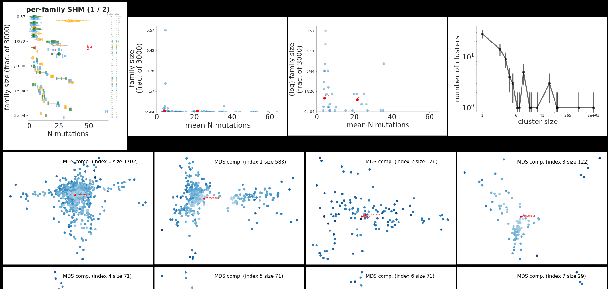

#### plotting

Note that in order to make plots for the `partition` action, you have to have R installed, along with several [extra packages](install.md#plotting).

The addition of `--plotdir <plotdir>` to most partis commands will write to disk a variety of plots related to that command.
These plots are written as svg files to subdirectories of `<plotdir>`, along with html files displaying clickable summaries of the svgs.
You typically want to view the html files in a browser, so a good way to see what's available might be to run `find <plotdir> -name '*.html' | xargs firefox` (although depending on the options, this can open a lot of tabs).
In addition, plots that are simply histograms usually also have their histogram content written to a csv in the same directory.
This makes it easier for later comparisons across several directories (for example with `bin/compare-plotdirs.py`).

If a `--plotdir` is specified during parameter caching (whether run automatically, or as a separate `cache-parameters` step), many plots related to rearrangement-level and shm-level parameters will be written to `sw/` and `hmm/` subdirs
Since partitioning has not yet occurred, however, these are all based on single-sequence annotations (rather than full-family, multi-sequence annotations), so they are not usually the best choice for final analysis (for instance, rearrangement-level parameters such as v gene choice will be counted once for each sequence in the family, rather than, as is proper, once for the whole family).
If both `--plotdir <plotdir>` and `--count-parameters` are both set when partitioning, then both parameter plots corresponding to the full multi-sequence annotations, and partitioning/cluster plots will both be written.
These multi-sequence parameter plots will go in the `multi-hmm/` subdir.
Examples can be found in `docs/example/plots/multi-hmm/` (open html files with a browser), but here we describe the structure and show example screenshots.
A summary of rearrangement-level parameters are shown in `docs/example-plots/multi-hmm/overall.html`:

And a summary of shm is in `docs/example-plots/multi-hmm/mute-freqs/overall.html`:

In addition, if `--make-per-gene-plots` and `--make-per-gene-per-base-plots` are set, a ton of more detailed plots are also written, with per-gene shm distributions in `docs/example-plots/multi-hmm/mute-freqs/per-gene`, for instance for d:

and per-gene, per-base plots in `docs/example-plots/multi-hmm/mute-freqs/per-gene-per-position`, for instance for j:

and also per-gene, per-position, per-base (e.g. showing the different rates of A to G vs A to C) in `docs/example-plots/multi-hmm/mute-freqs/{v,d,j}-per-base/`:

Plots for the partition action are written to the subdir `partitions/`, with the most important ones displayed in `partitions/overview.html`:

The top row shows several ways to summarize the clusters in the repertoire.
At top left is a plot with a colored blob/slug for each clonal family (sorted by size) whose extent along the x direction shows the distribution of number of SHMs within that family.
The (zero-indexed) family rank and size are shown along the right side.
Note that the three colors (green, blue, and yellow) have no separate significance, and are used only to visually distinguish adjacent slugs.
This particular plot also shows the result of setting some sequences of interest using `--queries-to-include a:b:z`, such that sequences labeled a, b, and z will be highlighted in red.
A typical use case for this option is if you have made several previous `seed-partition` runs (with e.g. `--seed-unique-id a`), and you want to see how the families of the seed sequences fit into the larger repertoire.
Only the first of these slug plots (with the biggest clusters) is shown in `overview.html` -- the rest are in the `partitions/shm-vs-size/` subdirectory (or click `shm-vs-size` link at top of page).
The middle two plots in the top row show the mean number of SHMs vs size for all the families in both linear and log scales.
At top right is the distribution of cluster sizes.

Below this, there is a "multi-dimensional scaling" (MDS, a form of dimensionality reduction) plot for each clonal family, where each sequence in each family is a point on that family's plot.
MDS takes each family (as a cluster in 400-odd dimensional sequence/hamming distance space) and squishes it out into two dimensions, choosing axes such as to maximize how squished out the family gets, while as nearly as possible preserving each inter-sequence distance from the real, 400-odd dimensional space.
Note that we use the [bios2mds R package](https://cran.r-project.org/web/packages/bios2mds/bios2mds.pdf), and ambiguous bases are *not* treated correctly, i.e. Ns show up as mutations (at least we can't figure out how to change this).
While there is no easy biological interpretation for the various directions on these plots, they do a good job of giving, at a glance, an overview of the basic structure of each family.
Both the inferred naive sequence and consensus sequence for each cluster are shown as red points on these plots (as are any queries specified with `--queries-to-include`), and the SHM rate of each sequence is given by its transparency (darker is more mutated).
So in cases where dots get uniformly less transparent as they get further from the red naive dot, this tells you that the dimension reduction is not losing very much information.
In cases where the plots are, on the other hand, uniformly speckled all over, the sequences are distributed more evenly across the 400-odd dimensional space (i.e. there wasn't a way to squish down to two dimensions without losing lots of information).
The plot title shows the family's zero-based, size-sorted index and size (matching the numbers on the right side of the slug plots).
The overview html again only shows plots for the largest few clusters, while the rest can be found in the `partitions/mds/` subdirectory (or click `mds` link at top of page).

You can write some even more speculatively informative plots if you uncomment the `make_laplacian_spectra_plots()` call in `python/partitionplotter.py`.
Below the MDS plots, there is a row of plots showing the Laplacian spectral decomposition for each cluster's tree (the rest are in the `laplacian-spectra/` subdir).
This converts the tree's distances into a set of eigenvalues, as described in [this paper](https://www.ncbi.nlm.nih.gov/pubmed/26658901), and implemented in the [RPANDA](https://besjournals.onlinelibrary.wiley.com/doi/full/10.1111/2041-210X.12526) R package.
This method is newer to us, so we have less to say about how best to interpret it, but it is perhaps useful to draw an analogy to analyzing a wave.
In a travelling wave the time domain (the tree, in our case) provides the most interpretable description of what is actually happening.
Moving to the frequency domain by Fourier transform (the Laplacian decomposition, in our case), while less interpretable in terms of the individual movements of the propagating medium, is typically far superior in terms of understanding the underlying processes driving wave formation.

For a description of the plots written during germline inference, see [here](germline-inference.md).
