[Up to table of contents](contents.md)

#### plotting
  * [parameter plots](#parameter-plots)
  * [partition plots](#partition-plots)
    - [extra color/emphasis](#extra-coloremphasis)
  * [selection metric plots](#selection-metric-plots)
  * germline inference plots: [separate file](germline-inference.md)
  * [annotation truth plots](#annotation-truth-plots)
  * [comparison plots](#comparison-plots)

The addition of `--plotdir <plotdir>` to most partis commands will write to disk a variety of plots related to that command.
These plots are written as svg files to subdirectories of `<plotdir>`, along with html files displaying clickable summaries of the svgs.
You typically want to view the html files in a browser, so a good way to see what's available might be to run `find <plotdir> -name '*.html' | xargs firefox` (although depending on the options, this can open a lot of tabs).
In addition, svgs that are simply histograms have their content written to a csv in the same directory.
This facilitates comparison across [different directories](#comparison-plots), as well as allowing the many re-plotting steps inevitably required during publication to involve only quick csv processing, rather than rerunning partis.
The svgs themselves can also be easily modified to change axis labels, fonts, colors, etc. using, for instance, [inkscape](https://inkscape.org/), or in simple cases `sed` or a text editor.

You can write different plot versions to different subdirectories by specifying `--sub-plotdir`.

#### parameter plots

If a `--plotdir` is specified during parameter caching (whether run automatically, or as a separate `cache-parameters` step), many plots related to rearrangement-level and shm-level parameters will be written to `sw/` and `hmm/` subdirs
Since partitioning has not yet occurred, however, these are all based on single-sequence annotations (rather than full-family, multi-sequence annotations), so they are not usually the best choice for final analysis (for instance, rearrangement-level parameters such as v gene choice will be counted once for each sequence in the family, rather than, as is proper, once for the whole family).
If both `--plotdir <plotdir>` and `--count-parameters` are both set when partitioning, then both parameter plots corresponding to the full multi-sequence annotations, and partitioning/cluster plots will both be written.
These multi-sequence parameter plots will go in the `multi-hmm/` subdir.
Examples can be found in `docs/example-plots/multi-hmm/` (open html files with a browser), but here we describe the structure and show example screenshots.
A summary of rearrangement-level parameters are shown in `docs/example-plots/multi-hmm/overall.html`:

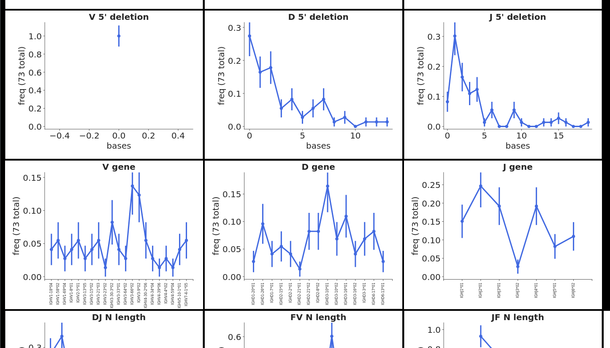

And a summary of shm is in `docs/example-plots/multi-hmm/mute-freqs/overall.html`:

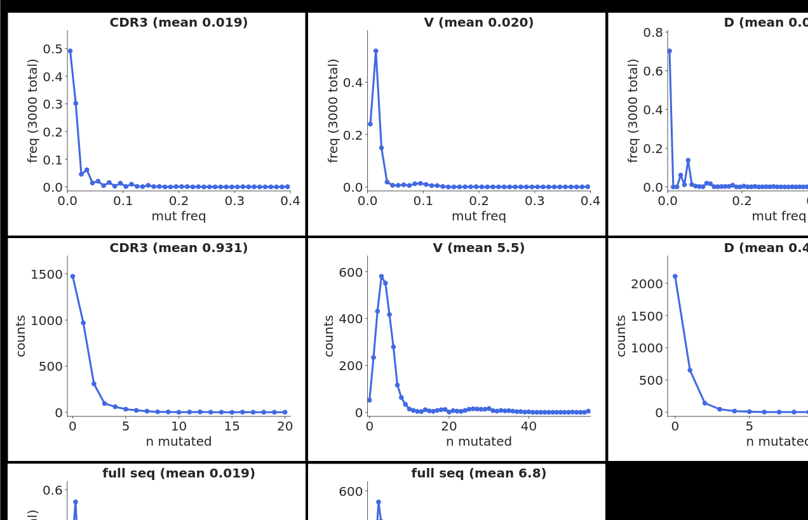

In addition, if `--make-per-gene-plots` and `--make-per-gene-per-base-plots` are set, a ton of more detailed plots are also written, with per-gene shm distributions in `docs/example-plots/multi-hmm/mute-freqs/per-gene`, for instance for d:

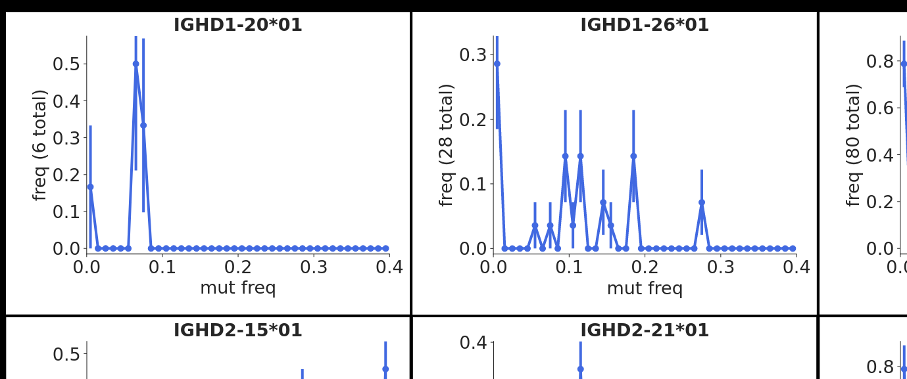

and per-gene, per-position mutation plots in `docs/example-plots/multi-hmm/mute-freqs/per-gene-per-position`, for instance for j:

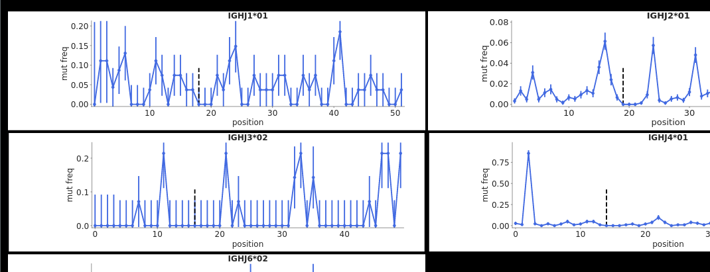

and also per-gene, per-position, per-base mutation (e.g. showing the different rates of A to G vs A to C, with germline bases below the x axis) in `docs/example-plots/multi-hmm/mute-freqs/{v,d,j}-per-base/`:

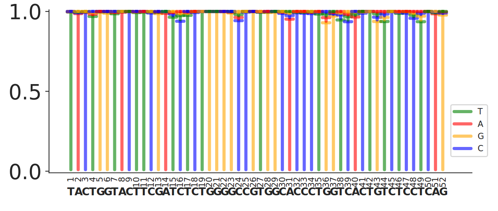

#### partition plots

Plots for the partition action are written to the subdir `partitions/`, with the most important ones displayed in `docs/example-plots/partitions/overview.html` (don't view this on github, but instead open the local file in the cloned repo with a browser), the top of which is screenshotted here:

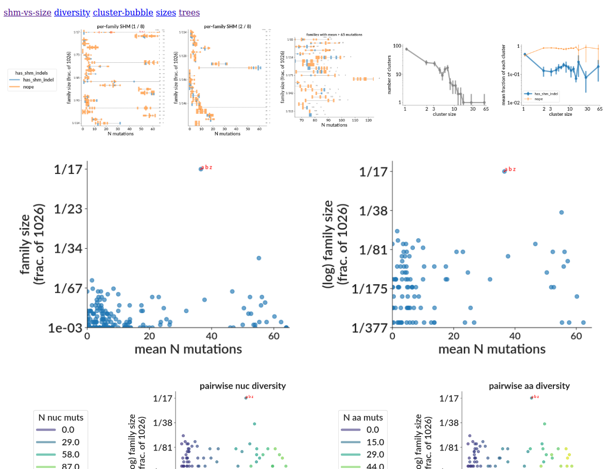

You can make similar plots with the command:

```
plot-partitions --outfname test/ref-results-slow/partition-new-simu.yaml --plotdir <plotdir> --meta-info-key-to-color has_shm_indels --queries-to-include 24657795d0:6a21d28533:3a4536bf60  # you'll need to update --queries-to-include if test file changes
```

At the top are links to subdirs/html files with all the plots.

At top left are several "slug" plots with a colored blob/slug for each clonal family:

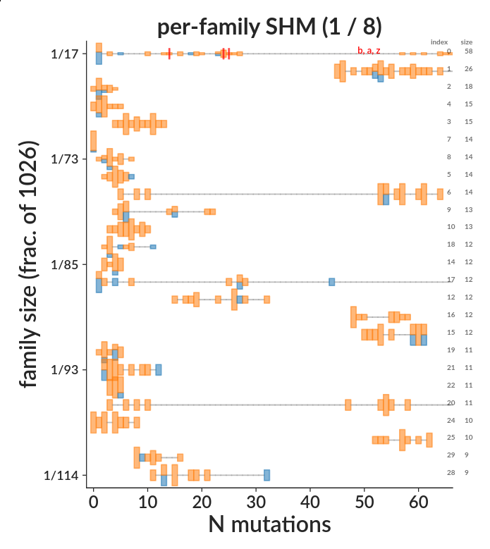

They are sorted by size, and each slug's extent along the x direction shows the distribution of number of SHMs within that family (i.e. it's basically a histogram of SHM).
The (zero-indexed) family rank and size are shown along the right side.
By default, the slugs cycle through three colors (green, blue, and yellow) which don't have any separate significance, and are used only to visually distinguish adjacent slugs.
Here, though, we've set `--meta-info-key-to-color has_shm_indels`, so seqs with indels are a different color to those without (this arg can be set to any per-seq key).
This plot also shows the result of setting some sequences of interest using `--queries-to-include a:b:z` (or `--queries-to-include-fname`), such that sequences labeled a, b, and z are highlighted in red (if set, `--seed-unique-id` would also be highlighted).
A typical use case for this option is if you have made several previous `seed-partition` runs (with e.g. `--seed-unique-id a`), and you want to see how the families of the seed sequences fit into the larger repertoire.
Only the first few of these slug plots (with the biggest clusters) is shown in `overview.html` -- the rest are in the `partitions/shm-vs-size/` subdirectory (and shown in html summary file `partitions/shm-vs-size.html`).

Next there are some cluster size histograms, again colored by shm indel status, which here indicates the fraction of families within each cluster size bin that had/didn't have shm indels (e.g. the largest bin, of clusters around size 65, is ~11% seqs with indels):

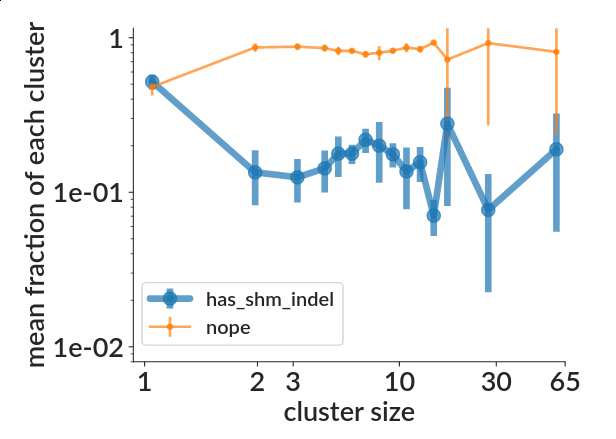

Next is a similar plot but with the total number of seqs in each cluster size bin for each meta info category:

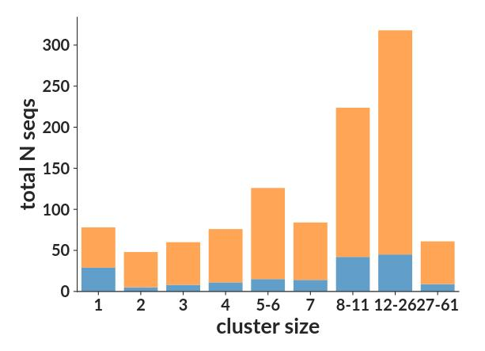

Below that are scatter plots with the mean number of SHMs vs size for all families in both linear and log scales (each family is a point).
Next are "pairwise diversity" plots (nucleotide version shown here, amino acid version in html):

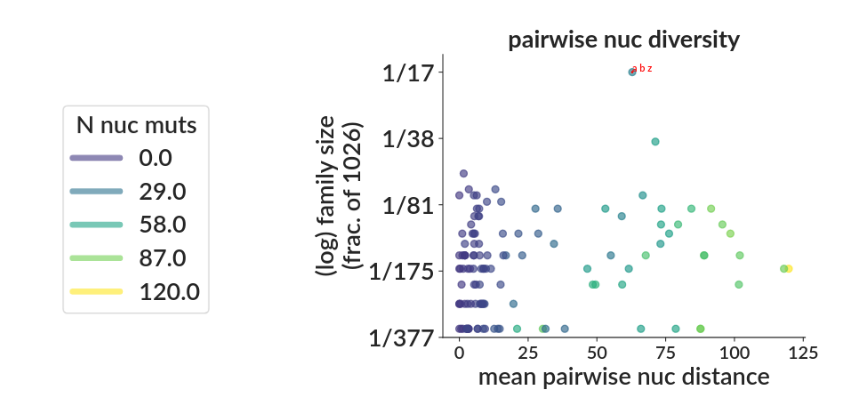

This is a scatter plot with each point a family colored by its mean SHM, plotting the family's mean pairwise distance on x vs family size on y.
Next is a "bubble" plot with a bubble (colored as a pie chart for seqs with/without indels) for each family larger than 2, with smaller families smushed together into a single bubble (the largest few families have their size printed near the center):

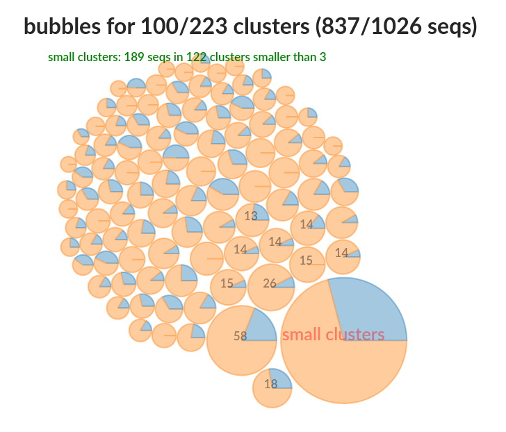

And, finally, we have trees, inferred as specified elsewhere, here still colored for indels and highlighting the `--queries-to-include`:

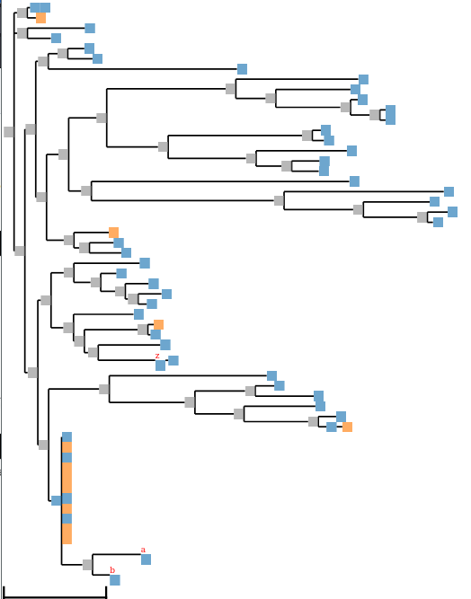

The selection of plots is controlled by `--partition-plot-cfg`, for instance if you only wanted tree and bubble plots, you'd set this to `tree:bubble`.
Other options not turned on by default (see below) include mds, laplacian-spectra, sfs, and subtree-purity. 

###### MDS plots
If you have R and bios2mds installed as described [here](install.md#mds-plotting), you can also make "multi-dimensional scaling" (MDS, a form of dimensionality reduction) plots for each clonal family, where each sequence in each family is a point on that family's plot.
Turn these on by adding "mds" to `--partition-plot-cfg`.
MDS takes each family (as a cluster in 400-odd dimensional sequence/hamming distance space) and squishes it out into two dimensions, choosing axes such as to maximize how squished out the family gets, while as nearly as possible preserving each inter-sequence distance from the real, 400-odd dimensional space.
Note that we use the [bios2mds R package](https://cran.r-project.org/web/packages/bios2mds/bios2mds.pdf), and ambiguous bases are *not* treated correctly, i.e. Ns show up as mutations (at least we can't figure out how to change this).
While there is no easy biological interpretation for the various directions on these plots, they do a good job of giving, at a glance, an overview of the basic structure of each family.
Both the inferred naive sequence and consensus sequence for each cluster are shown as red points on these plots (as are any queries specified with `--queries-to-include` or `--queries-to-include-fname`), and the SHM rate of each sequence is given by its transparency (darker is more mutated).
So in cases where dots get uniformly less transparent as they get further from the red naive dot, this tells you that the dimension reduction is not losing very much information.
In cases where the plots are, on the other hand, uniformly speckled all over, the sequences are distributed more evenly across the 400-odd dimensional space (i.e. there wasn't a way to squish down to two dimensions without losing lots of information).
Note that duplicate sequences are collapsed/removed before passing to the MDS method, so you can't tell in the final plot how many sequences contribute to any one point.
The plot title shows the family's zero-based, size-sorted index and size (matching the numbers on the right side of the slug plots).
The overview html again only shows plots for the largest few clusters, while the rest can be found in the `partitions/mds/` subdirectory.

###### Laplacian spectra
You can write some even more speculatively informative plots if you uncomment the `make_laplacian_spectra_plots()` call in `python/partitionplotter.py`.
Below the MDS plots, there is a row of plots showing the Laplacian spectral decomposition for each cluster's tree (the rest are in the `laplacian-spectra/` subdir).
This converts the tree's distances into a set of eigenvalues, as described in [this paper](https://www.ncbi.nlm.nih.gov/pubmed/26658901), and implemented in the [RPANDA](https://besjournals.onlinelibrary.wiley.com/doi/full/10.1111/2041-210X.12526) R package.
This method is newer to us, so we have less to say about how best to interpret it, but it is perhaps useful to draw an analogy to analyzing a wave.
In a travelling wave the time domain (the tree, in our case) provides the most interpretable description of what is actually happening.
Moving to the frequency domain by Fourier transform (the Laplacian decomposition, in our case), while less interpretable in terms of the individual movements of the propagating medium, is typically far superior in terms of understanding the underlying processes driving wave formation.
Making laplacian spectra will require installation of the following:
```
# RPANDA stuff (sorry this is hackey, but at least a.t.m. we need to use this modified src [i.e. not what it is in CRAN])
mkdir -p packages/RPANDA/lib
R CMD INSTALL -l packages/RPANDA/lib packages/RPANDA/
```

###### extra color/emphasis

There are several ways to add additional coloring and emphasis to the partition plots.
You can separate different values of a variable with different colors using `--meta-info-key-to-color`, for instance giving different timepoints different colors with `--meta-info-key-to-color timepoints` (if you've added [timepoint meta info](#input-meta-info)).
You can also use `--meta-info-to-emphasize` to highlight sequences with particular values of a variable (similar to `--queries-to-include`), for instance with a particular number of mutations `n_mutations,N`.
For instance here we've colored samples by timepoint, and highlighted sequences from a paired sample (to the latter of which we added an input meta info key `paired` set to `True`, and used `--meta-info-to-emphasize paireds,True`):

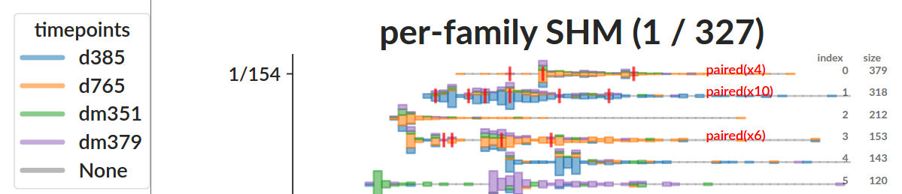

Some details and formatting can be further modified with `--meta-emph-formats` (see `partis partition --help` for details).

#### selection metric plots

If `--plotdir` is set when getting selection metrics, a variety of plots are written, also summarized in an html (example in `docs/example-plots/tree-metrics/overview.html`).
The particular selection metrics to calculate are specified with `--selection-metrics-to-calculate`, and the plots to make are set with `--selection-metric-plot-cfg`; for instance `--selection-metrics-to-calculate lbi --selection-metric-plot-cfg lb-vs-affy:slice:joy:lb-vs-daffy:lb-scatter:tree` would make the same selection of plots as by default, but only for lbi.
We won't describe the plots in detail here, but most of them are described in the selection metric paper, please feel free to email for any details.

#### germline inference plots

For a description of the plots written during germline inference, see [here](germline-inference.md).

#### annotation truth plots

If you're running on simulation, you can turn on `--is-simu` and write plots comparing the action's annotation performance to the simulation truth values by setting `--plot-annotation-performance`.
This writes performance plots in three categories/subdirs: boundaries, gene calls, and mutation.
For instance, after running [bin/compare-plotdirs.py](#comparison-plots) we can compare the performance plots for smith-waterman annotation and the partition-based multi-hmm:
```
pdir=docs/example-plots
subd=annotation-performance
compare-plotdirs.py --outdir $pdir/comparisons/$subd --plotdirs $pdir/$subd/sw:$pdir/$subd/hmm --names sw:multi-hmm --normalize --performance-plots
```
Which looks like this for two of the (many) resulting plots:

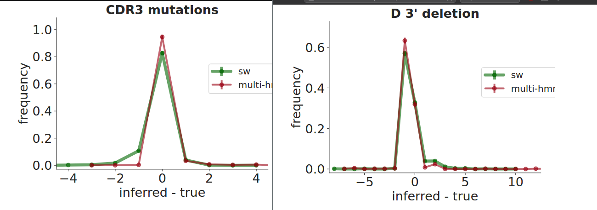

#### comparison plots

The csv files that are written during plotting alongside all histogram-type svgs are designed to allow quick comparisons across different plotting directories.
For instance, comparing/combining to plots for several different subjects, or different inference methods.
This is accomplished with `bin/compare-plotdirs.py`, which takes a colon-separated list of plotdirs (and their corresponding names), and looks for corresponding csv plot files.
We demonstrate its use by comparing some of the smith-waterman, hmm, and multi-hmm parameter plots in `docs/example-plots`:

```
pdir=docs/example-plots
subd=overall #mute-freqs/overall
compare-plotdirs.py --outdir $pdir/comparisons --plotdirs $pdir/sw/$subd:$pdir/hmm/$subd:$pdir/multi-hmm/$subd --names sw:hmm:multi-hmm --normalize
```

With the result, say for d 5' deletion and v gene call showing the multi-hmm's significantly different (and improved) performance:

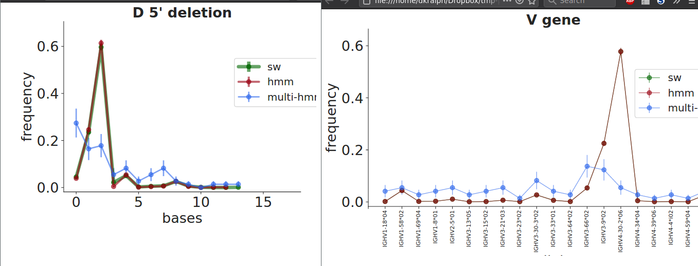

You can see here (by the much larger uncertainties) that the multi-hmm is counting each family only once (as is proper), rather than counting each sequence individually (as sw and the single hmm have to, since they don't have access to the partition).
