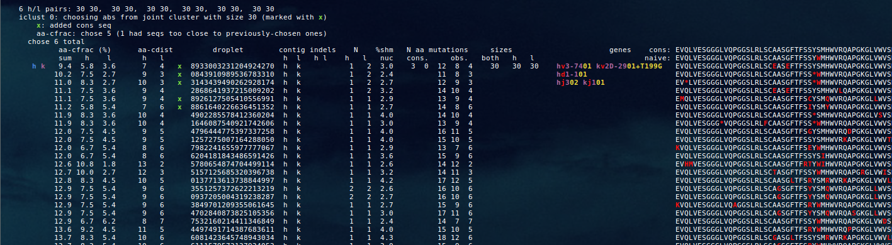
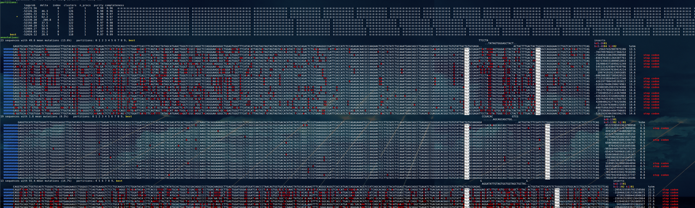
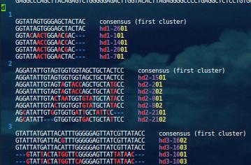
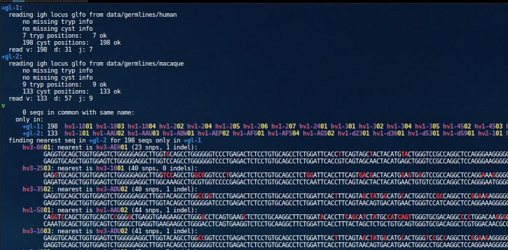
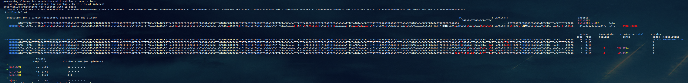
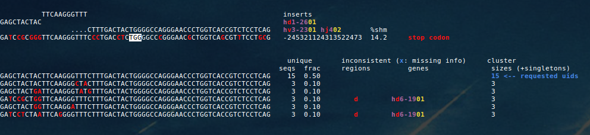
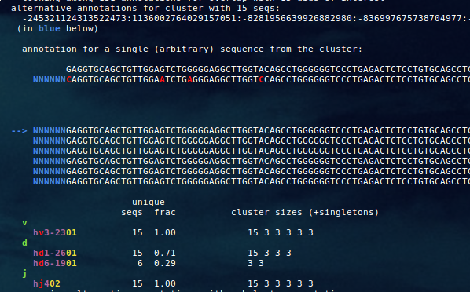

[Up to table of contents](contents.md)

  - [overview](#overview)
  - [annotate](#annotate) find most likely annotation for each sequence
  - [partition](#partition) cluster sequences into clonally-related families, and annotate each family
    - [fast (naive vsearch)](#--fast-synonym---naive-vsearch)
    - [subsampling](#subsampling)
    - [ignore small clusters](#ignore-smaller-clusters)
    - [subset-partition](#partition-in-subsets)
    - [limit maximum cluster size](#limit-maximum-cluster-size)
    - [deliberate over-clustering](#deliberate-over-clustering)
	- [progress file](#progress-file)
  - [subset-partition](#subset-partition)
  - [merge-paired-partitions](#merge-paired-partitions) use heavy/light pairing information to refine single-chain partitions (more [here](paired-loci.md))
  - [get-selection-metrics](#get-selection-metrics) calculate selection metrics (lbi, lbr, consensus distance, etc) on existing output file
    - [choosing antibodies](#choosing-antibodies)
  - [view-output](#view-output) print the partitions and/or annotations from an existing output file
  - [cache-parameters](#cache-parameters) write parameter values and HMM model files for later inference (runs automatically, if needed)
    - [germline sets](#germline-sets)
  - [simulate](#simulate) make simulated sequences
  - [other topics](#other-topics)
    - [restricting to certain partitions or clusters](#restricting-to-certain-partitions-or-clusters)
    - [subcluster annotation](#subcluster-annotation)
	- [annotation uncertainties (alternative annotations)](#annotation-uncertainties-alternative-annotations)
    - [naive rearrangement probability estimates](#naive-rearrangement-probability-estimates)
    - [input meta info](#input-meta-info)
	- [naive sequence comparison with linearham](#naive-sequence-comparison-with-linearham)
    - [tree inference](#tree-inference) tree inference methods included in/supported by partis

### overview

`partis` takes a single positional argument specifying the action/subcommand to be run:

```
partis <action> <other args>
```

For information on options for each subcommand that are not documented in this manual run `partis <subcommand> --help`.

For the sake of brevity, the commands below invoke partis with no leading path, which will work if you've either:
  - linked the binary into to a directory that's already in your path, e.g. `ln -s /path/to/partis/dir/bin/partis ~/bin/` or
  - added the partis `bin/` to your path: `export PATH=/path/to/partis/dir/bin/:$PATH`
The other option is to specify the full path with each call `/path/to/partis/dir/bin/partis`.

You can also import partis as a module rather than running command line scripts (see [quick start](quick-start.md) for details).

### annotate

In order to find the most likely annotation (VDJ assignment, deletion boundaries, etc.) for each single sequence, run

```
partis annotate --infname test/example.fa --outfname _output/example.yaml
```

For information on parsing the output file, see [here](output-formats.md).

### partition

In order to cluster sequences into clonal families and annotate each family, run

```
partis partition --infname test/example.fa --outfname _output/example.yaml
```

For information on parsing the output file, see [here](output-formats.md).

By default, this uses the most accurate and slowest method: hierarchical agglomeration with, first, hamming distance between naive sequences for distant clusters, and full likelihood calculation for more similar clusters. This method is typically appropriate (finishing in minutes to tens of hours) for tens of thousands of sequences on a laptop, or hundreds of thousands on a server. Because the usual optimizations that prevent clustering time from scaling quadratically with sample size do not translate well to BCR rearrangement space (at least not if you care about getting accurate clusters), run time varies significantly from sample to sample, hence the large range of quoted run times.

There are also a number of options for speeding things up either by sacrificing accuracy for speed, or by ignoring sequences you don't care about:

##### `--fast` (synonym: `--naive-vsearch`)

As for the default (full) clustering method, first calculates the naive ancestor for each sequence, but then passes these to vsearch for very fast heuristic clustering.
Vsearch is fast because it includes a large number of optimizations to avoid all-against-all comparison, and thus scales much better than quadratically.
Because these optimizations (like any purely distance-based approach) know nothing about VDJ rearrangement or SHM, however, they reduce accuracy.
This is nevertheless a thoroughly reasonably way to get an idea of the lineage structure of your sample.
After running vsearch clustering, you can always pass families of interest (e.g. with `--seed-unique-id`) to the more accurate clustering method.
If the input file contains more than `--max-n-seqs-to-likelihood-cluster` sequences (10,000 by default), this is turned on in order to speed things up.

##### subsampling

The simplest way to go faster is to only use some of your sequences. You can choose a random subset with `--n-random-queries <n>` (random seed is set with `--seed <n>`), or take the first `n` sequences with `--n-max-queries <n>`. You can also limit it to specific sequence ids using `--queries <a:b:c>`, where `a:b:c` is a colon-separated list of sequence ids.

##### `--seed-unique-id <id>`

Ignores sequences that are not clonally related to the sequence specified by `<id>`, and is consequently vastly faster than partitioning the entire sample. You can specify the sequence rather than the id with `--seed-seq <seq>`.

##### ignore smaller clusters

If you're mostly interested in larger clonal families, you can tell it to cluster as normal for several partition steps, then discard smaller families (for a description of partition steps, see the paper). Any large families will have accumulated appreciable size within the first few partition steps, and since most real repertoires are dominated by smaller clusters, this will dramatically decrease the remaining sample size. This is turned on by setting `--small-clusters-to-ignore <sizes>`, where `<sizes>` is either a colon-separated list of clusters sizes (e.g. `1:2:3`) or an inclusive range of sizes (e.g. `1-10`). The number of steps after which these small clusters are removed is set with `--n-steps-after-which-to-ignore-small-clusters <n>` (default 3).

##### partition in subsets

See section [below](#subset-partition) on the `subset-partition` action, which first splits the sample into subsets, partitions each one, then merges the resulting partitions together.

##### limit maximum cluster size

Cases where memory is a limiting factor typically stem from a sample with several very large families. Some recent optimizations mean that this doesn't really happen any more, but limiting clonal family size with `--max-cluster-size N` nevertheless can reduce memory usage. Care must be exercised when interpreting the resulting partition, since it will simply stop clustering when any cluster reaches the specified size, rather than stopping at the most likely partition.

##### deliberate over-clustering

Normal partis clustering proceeds via hierarchical agglomeration, i.e. begins with all sequences separate, then iteratively merges similar clusters.
It stops when further merging would make for a less-likely partition.
In some cases, however, you may be interested in all sequences that could possibly be related (perhaps to `--seed-unique-id`), i.e. in a less likely, over-merged, partition.
If you set `--n-final-clusters N` partis will try to keep clustering until there are `N` clusters ("try" because it can never merge very different sequences, e.g. with different CDR3 length).
You can also set `--min-largest-cluster-size N`, in which case it will try to keep merging until the largest cluster is at least of size `N`.

##### progress file

Since individual steps of the partition algorithm can be somewhat time consuming, during each step we periodically update a file with clustering status information so you can monitor progress.
This file is written to the working directory, which you've either set, or is under `/tmp/$USER/hmms`.
The easiest way to find the working directory is to run an appropriate `ps` command to get the complete command lines of each subprocess (for instance `ps -Ho pid,args` or `ps -eo pcpu,pmem,rss,cputime:12,stime:7,user,pid,args:100 --sort pmem,pcpu`, depending if you're running from the terminal that called partis or not).
For instance running the former in a terminal in which I've backgrounded the partis command gives (so the parent python process is currently clustering with one bcrham subprocess):

```
  PID COMMAND
 2677 -bash
 4685   python partis partition --infname test/reference-results/test/simu.yaml
 4734     bcrham --algorithm forward --hmmdir /home/dralph/work/partis/_output/test_reference-results_test_simu/hmm/hmms --datadir /tmp/dralph/hmms/902992/germline-sets --infile /tmp/dralph/hmms/902992/hmm_input.csv --outfile /tmp/dralph/hmms/902992/hmm_output.csv --locus igh --random-seed 1554239923 --input-cachefname /tmp/dralph/hmms/902992/hmm_cached_info.csv --output-cachefname /tmp/dralph/hmms/902992/hmm_cached_info.csv --partition --max-logprob-drop 5.0 --hamming-fraction-bound-lo 0.015 --hamming-fraction-bound-hi 0.0711739130435 --logprob-ratio-threshold 18.0 --biggest-naive-seq-cluster-to-calculate 15 --biggest-logprob-cluster-to-calculate 15 --n-partitions-to-write 10 --write-logprob-for-each-partition --ambig-base N
 6836   ps -Ho pid,args
```

There will be a progress file for each subprocess in the clustering step, in their own subdirectories, and the name of each progress file will look like `<stuff>.progress`.
A few lines from a typical progress file might look like:

```
      Apr 02 14:19:35    1850 clusters        45160 / 32857084 kB =  0.137 %           calcd:   vtb 281   fwd 0     hfrac 154382          merged:  hfrac 1    lratio 0                  clusters:  38 30 15 7 7 7 7 7 6 6 6 6 6 5 5 5 5 5 5 5 5 5 5 5 5 5 5 5 5 5 5 5 5 4 4 4 4 4 4 4 4 4 4 4 4 4 4 4 4 4 4 4 4 4 4 4 4 3 3 3 3 3 3 3 3 3 3 3 3 3 3 3 3 3 3 3 3 3 3 3 3 3 3 3 3 3 3 3 3 3 3 3 3 3 3 3 3 3 3 3 3 3 3 3 3 3 3 3 3 3 3 3 3 3 3 3 2 2 2 2 2 2 2 2 2 2 2 2 2 2 2 2 2 2 2 2 2 2 2 2 2 2 2 2 2 2 2 2 2 2 2 2 2 2 2 2 2 2 2 2 2 2 2 2 2 2 2 2 2 2 2 2 2 2 2 2 2 2 2 2 2 2 2 2 2 2 2 2 2 2 2 2 2 2 2 2 2 2 2 2 2 2 2 2 2 2 2 2 2 2 2 2 2 2 2 2 2 2 2 2 2 2 2 2 2 2 2 2 2 2 2 2 2 2 2 2 2 2 2 2 2 2 2 2 2 2 2 2 2 2 2 2 2 2 2 2 2 2 2 2 2 2 2 2 2 2 2 2 2 2 2 2 2 2 2 2 2 2 2 2 2  (1569 singletons)
      Apr 02 14:29:22    1841 clusters        47068 / 32857084 kB =  0.143 %           calcd:   vtb 281   fwd 0     hfrac 155609          merged:  hfrac 10   lratio 0                  clusters:  38 30 15 7 7 7 7 7 7 6 6 6 6 6 5 5 5 5 5 5 5 5 5 5 5 5 5 5 5 5 5 5 5 5 5 4 4 4 4 4 4 4 4 4 4 4 4 4 4 4 4 4 4 4 4 4 4 4 4 4 4 4 3 3 3 3 3 3 3 3 3 3 3 3 3 3 3 3 3 3 3 3 3 3 3 3 3 3 3 3 3 3 3 3 3 3 3 3 3 3 3 3 3 3 3 3 3 3 3 3 3 3 3 3 3 3 3 3 3 3 2 2 2 2 2 2 2 2 2 2 2 2 2 2 2 2 2 2 2 2 2 2 2 2 2 2 2 2 2 2 2 2 2 2 2 2 2 2 2 2 2 2 2 2 2 2 2 2 2 2 2 2 2 2 2 2 2 2 2 2 2 2 2 2 2 2 2 2 2 2 2 2 2 2 2 2 2 2 2 2 2 2 2 2 2 2 2 2 2 2 2 2 2 2 2 2 2 2 2 2 2 2 2 2 2 2 2 2 2 2 2 2 2 2 2 2 2 2 2 2 2 2 2 2 2 2 2 2 2 2 2 2 2 2 2 2 2 2 2 2 2 2 2 2 2 2 2 2 2 2 2 2 2 2 2 2 2  (1564 singletons)
      Apr 02 14:29:53    1813 clusters        50876 / 32857084 kB =  0.155 %           calcd:   vtb 289   fwd 0     hfrac 159161          merged:  hfrac 38   lratio 0                  clusters:  38 30 15 13 11 9 9 7 7 7 7 7 6 6 6 6 5 5 5 5 5 5 5 5 5 5 5 5 5 5 5 5 5 5 5 5 5 5 4 4 4 4 4 4 4 4 4 4 4 4 4 4 4 4 4 4 4 4 4 4 4 4 4 4 4 4 3 3 3 3 3 3 3 3 3 3 3 3 3 3 3 3 3 3 3 3 3 3 3 3 3 3 3 3 3 3 3 3 3 3 3 3 3 3 3 3 3 3 3 3 3 3 3 3 3 3 3 3 3 3 3 3 3 3 3 3 3 3 2 2 2 2 2 2 2 2 2 2 2 2 2 2 2 2 2 2 2 2 2 2 2 2 2 2 2 2 2 2 2 2 2 2 2 2 2 2 2 2 2 2 2 2 2 2 2 2 2 2 2 2 2 2 2 2 2 2 2 2 2 2 2 2 2 2 2 2 2 2 2 2 2 2 2 2 2 2 2 2 2 2 2 2 2 2 2 2 2 2 2 2 2 2 2 2 2 2 2 2 2 2 2 2 2 2 2 2 2 2 2 2 2 2 2 2 2 2 2 2 2 2 2 2 2 2 2 2 2 2 2 2 2 2 2 2 2 2 2 2 2 2 2  (1542 singletons)
```

The columns are:
  * time the line was written. There are a number of points in the clustering code that trigger a progress file write, but typically a new line is written once each time it loops through all the current clusters looking for merges.
  * total number of clusters
  * memory allocated to this clustering process (i.e. bcrham).
  * total number of viterbi, forward, and naive hamming fraction calculations that have so far been made
  * total number of cluster merges that have so far been performed, broken down into hamming fraction merges and likelihood ratio (i.e. forward calculation) merges
  * a list of all cluster sizes in the current partition

### subset-partition

This action splits the input into `--n-subsets` subsets, caches parameters and partitions each subset individually, then partitions the merged results.
When combined e.g. with `--small-clusters-to-ignore`, this substantially speeds up (and reduces memory usage of) partitioning on large samples, since each subset's process will discard many smaller clusters, reducing the computational load on the final, merging process.
Even when run with default arguments it is often faster, since the subset processes do much of the merging in a smaller (and thus more efficient) subset of the input.

### subset-annotate

Same as `subset-partition`, but just performs annotation with subsets, rather than partitioning.
Since normal annotation, unlike partitioning, is easily split up into independent processes, this is less important than `subset-partition`; nevertheless it probably still uses substantially less memory.

### merge-paired-partitions

Refine the separate single-chain partitions (igh, igk, igl) using heavy/light pairing information (e.g. from 10x single cell data).
Runs automatically after partitioning if `--paired-loci` is set -- this action is for running only the merge step on an existing paired output dir.
Details [here](paired-loci.md).

### get-selection-metrics

Calculate quantities for prediction of fitness/affinity, as described [here](https://doi.org/10.1371/journal.pcbi.1008391).
At the moment metrics include: AA distance to clonal family consensus sequence (aa-cdist), and local branching index and ratio (lbi and lbr, in both nucleotide and amino acid versions).
aa-cdist is an excellent predictor of an antibody's affinity for an antigen, but it has no information about what that antigen is, so it should be paired with some method using non-sequence information, such as vaccination or cell sorting (see Discussion in the paper).
Given an antibody of interest and its inferred ancestral lineage, aa-lbr is an excellent predictor of which branches between those ancestors are likely to contain affinity-increasing mutations.
In order to infer ancestral sequences (and just to have a more accurate tree), if using aa-lbr you should use a program that includes proper phylogenetic inference (see [below](#tree-inference)).

Note that we made some significant improvements to aa-lbr (and lbr) as of Sep 2021, which are described [here](lb-correction.pdf).

You can run the `get-selection-metrics` action either on an existing partis output file, or add `--get-selection-metrics` when running the `partition` action.
The former is generally better, since you can then pass in your own separately-inferred trees with `--treefname`, and also run several different versions without having to re-partition (see `--selection-metric-fname`).
Both lbi and aa-cdist can include multiplicity information for each sequence (e.g. from expression levels), see [below](#input-meta-info).

Both lbi and lbr (in nucleotide or amino acid versions) need a tree, so unless you pass in your own, partis will make one.
Since we want this to be fast enough to run on most of the families in a large repertoire, this uses a fairly heuristic approach to calculating trees.
If this is run in the context of partitioning (so there's a clustering path available from hierarchical agglomeration), then that clustering path is used as the starting point for the tree.
It is then refined by replacing any subtrees stemming from large multifurcations with a subtree inferred using FastTree (for instance, the first clustering step is to merge all sequences with similar inferred naive sequences, which results in such subtrees).
If no clustering path information is available, FastTree is used to infer the tree for the entire cluster.
This will make a tree for each cluster in the best partition that's larger than --min-tree-metric-cluster-size (default), and any additional clusters specificied by --write-additional-cluster-annotations, --calculate-alternative-annotations, --min-largest-cluster-size, etc., or restricted with --cluster-index.
These heuristic trees are typically fine for general studies (and note that aa-cdist does not use a tree at all), but if you're studying a lineage in great detail, especially using aa-lbr, it's probably worth using more sophisticated methods (see [below](#tree-inference)).

If you'd like a modern, browser-based package for visualizing the families and their trees and annotations, have a look at our other project, [Olmsted](https://github.com/matsengrp/olmsted/).

##### Choosing antibodies

There is also infrastructure to facilitate actually choosing Abs based on the selection metrics.
Abs are chosen whenever getting selection metrics on paired data, and if `--chosen-ab-fname` is set they are written to the indicated csv file.
You probably also want to set `--debug 1` in order to get detailed ascii information about which Abs were chosen, which looks something like:



The many possible ways to choose Abs are controlled with a yaml config file, whose location is specified with `--ab-choice-cfg`, with default in `data/selection-metrics/ab-choice.yaml`.
Here is an example:
```
n-families: 2
include-unobs-cons-seqs: True
vars:
  # sort each family by the indicated variable, with direction <sort>, then take the top <n> seqs that haven't already been taken and that pass all other criteria
  aa-cfrac: {sort: low, n: [5, 3]}  # specity either 'n:' here *or* 'n-per-family:' below
  # shm-aa: {sort: high, n: [3, 3, 3, 3, 3, 2, 2, 2, 2, 2]}
# cell-types: [pb]
max-ambig-positions: 2  # summed over h+l amino acid seqs
# min-umis: 1000
# n-per-family: [3, 2]  # specify either this *or* 'n:' for each of the 'vars:'
# min-median-nuc-shm-%: 2
min-hdist-to-already-chosen: 3  # only choose abs whose h/l seqs are at least this far from previously-chosen seqs (in amino acid hamming distance, summed over h+l)
# droplet-ids: [TGACGGCGTCACCCAG-1, AGACGTTTCAACCAAC-1]  # choose specific droplet ids, before applying other criteria
```
For instance, you might want to choose M, N, P Abs from each of the 3 largest families.
To get the M Abs from the first family, you might take the top M sorted by aa-cdist, with additional criteria on [input meta info](#input-meta-info) like cell type or umis.
Look in the default config file for further descriptions of parameters.
If you want to just re-choose Abs (e.g. if you changed the config file) without recalculating selection metrics, set `--dry-run`.

### view-output

This will view an ascii-art summary of the output in an existing partis output file, for instance:

``` 
partis view-output --outfname test/reference-results/partition-new-simu.yaml --abbreviate | less -RS
```
will look something like (move around with arrow keys)



where the first block shows a list of the most likely partitions (from near the end of tha partitioning process, with the best partition marked in yellow).
The next block shows the annotation for (by default) each cluster in the best partition.
Each annotation is shown with the top three lines showing germline sequences/genes: 1. non-templated insertions, 2. D gene, 3. V and J genes.
Each subsequent line is an observed sequence, with point mutations in red, ambiguous bases as blue Ns, and SHM indels as blue dashes/stars.

You can use `--extra-print-keys` to specify a list of keys that you'd like printed to the right of each sequence, for instance `--extra-print-keys paired-uids:n_mutations`.

You can also send std out to a log file `>log.txt` instead of piping to `less -RS`.

### cache-parameters

Infer a set of parameters describing insertion, deletion, mutation, germline set, etc., which are used to write hmm yaml model files for later inference.
This is run automatically if `--parameter-dir` doesn't exist (whether this directory is specified explicitly or not).
So you do not, generally, need to run it on its own.

When presented with a new data set, the first thing we need to do is infer a set of parameters, a task for which we need a preliminary annotation.
As such, partis first runs ig-sw's Smith-Waterman algorithm on the data set.
The smith-waterman annotations are used to build and write out a parameter set, which is in turn used to make a set of HMM model files for each observed allele.
These files are then passed as input to a second, HMM-based, annotation step, which again outputs (more accurate) parameter values and HMM model files.

To explicitly run this parameter caching step by itself:

``` 
partis cache-parameters --infname test/example.fa --parameter-dir _output/example
```

The resulting parameter csvs from Smith-Waterman and the HMM are put into `/sw` and `/hmm` subdirectories of `--parameter-dir`.
Within each of these, there are a bunch of csv files with (hopefully) self-explanatory names, e.g. `j_gene-j_5p_del-probs.csv` has counts for J 5' deletions subset by J gene.
The hmm model files go in the `hmms/` subdirectory, which contains yaml HMM model files for each observed allele.

If you don't specify `--parameter-dir`, it defaults to a location in the current directory that amounts to a slight bastardization of your input file path (e.g. parameters for `path/to/seqs.fa` will go in `_output/path_to_seqs/`).
This default is designed such that with typical workflows, if your input files have different paths, their parameters will go in different places.
If you run once, and then put different sequences in the same input file, this convention obviously horribly breaks (you'll be applying the parameters from the sequences in the old file contents to the new file).

If `--parameter-dir` (whether explicitly set or left as default) doesn't exist, partis assumes that it needs to cache parameters, and does that before running the requested action.

Whether caching parameters or running on pre-existing parameters, the hmm needs smith-waterman annotations as input.
While this preliminary smith-waterman step is fairly fast, it's also easy to cache the results so you only have to do it once.
By default these smith-waterman annotations are written to a yaml file in `--parameter-dir` during parameter caching (default path is `<parameter_dir>/sw-cache-<hash>.yaml` where `<hash>` is a hash of the input sequence ids).
(Because all sequences need to be aligned and padded to the same length before partititioning, the smith-waterman annotation information for each sequence depends slightly on all the other sequences in the file, hence the hash.)
These defaults should ensure that with typical workflows, smith-waterman only runs once.
If however, you're doing less typical things (running on a subset of sequences in the file), if you want smith-waterman results to be cached you'll need to specify `--sw-cachefname` explicitly, and it'll write it if it doesn't exist, and read from it if it does.

#### germline sets
By default partis infers a germline set for each sample during parameter caching, using as a starting point the germline sets in `data/germlines/<--species>` (see also data/germlines/README.md).
The resulting per-sample germline sets are written both to the output yaml file (if you've set `--outfname`), and to `<--parameter-dir>/hmm/germline-sets` (as three fasta files and a meta-info csv).
To start from a non-default germline set, use `--initial-germline-dir <dir>.`
This dir must use the same format as `data/germlines/<--species>`, i.e. have a subdir for the `--locus` you want to run, and in that subdir have a fasta file for v, d, and j, and a csv file with the (zero-indexed!) conserved codon positions for each v/j gene.
The easiest way to construct this is to copy the files from `data/germlines/<--species>`, and then substitute the fasta files for your own.
Partis aligns any genes that are missing codon information against genes with known info, so as long as there's some overlap with the default germline, it should be able to figure out a position for each gene.

If you want to be more careful, it's a good idea to check how it's figuring out the extras.csv info.
You can do this (after modifying the new dir) by running the following lines, for example by adding them to the top of bin/example-output-processing.py (just after it imports glutils):

```
ref_glfo = glutils.read_glfo('data/germlines/human', locus='igh', debug=True)
new_glfo = glutils.read_glfo('new-germline-dir', locus='igh', template_glfo=ref_glfo, debug=2)  # adds missing codon info
print 'cleaned up glfo:'
glutils.print_glfo(new_glfo)  # print the cleaned up glfo
glutils.write_glfo('cleaned-up-new-germline-dir', new_glfo, debug=True)
sys.exit()
```

Where we pass the `ref_glfo` as a template glfo, which makes it more likely to be able to figure out the cyst/tryp/phen info. And you'll probably want to pipe to `|less -RS`, especially if on a laptop.

By default, if `--species` is set to human this only looks for alleles that are separated by point mutations from existing genes.
This is appropriate for humans, since the known germline set is fairly complete.
For species for which the known germline sets are much less complete (e.g. macaque and mice), it makes sense to also look for alleles that are separated by indels and/or many SNPs from existing genes.
This is the default for non-human species, and is equivalent to turning on `--allele-cluster`.

You can turn off all germline inference with `--leave-default-germline`; there are also commands to turn off the various component steps individually (see help for details).

At the moment we only infer germline sets for V, and not for D and J (although we plan to fix this).
This isn't horribly nonsensical, since there is much less variation in D and J, but it does mean that you should treat the D germline set, in particular, with quite a bit of skepticism.
You may also be able to use [other tools](https://pubmed.ncbi.nlm.nih.gov/31134072/) to infer D genes.

We unfortunately do not yet have a way to report simple confidence estimates for each gene in the inferred germline set.
There is, however, a wealth of information that can be used to get a good sense of this confidence [here](germline-inference.md).

There are also two utility scripts for comparing germline sequences (`bin/cf-alleles.py`) and sets (`bin/cf-germlines.py`).
To compare all sequences in a particular germline set:
```
cf-alleles.py --bases all | less -RS
```
which by default looks at igh genes in the default location, and aligns all alleles within each primary gene version together, e.g. for D:


Whereas to compare only the alleles of a specific V gene, for instance, you could run:
```
cf-alleles.py --bases 1-18 --region v --ref-allele 03
```
To compare two different germline sets, on the other hand, use `bin/cf-germlimes.py`.
For instance the following would compare human and macaque igh:
```
cf-germlines.py data/germlines/human data/germlines/macaque | less -RS
```
and display a rundown of alleles in common and unique to each set, as well as aligning them against the nearest allele in the other set:


### simulate

Default simulation requires some additional [installation steps](install.md#simulation).

There are two main partis-only simulation modes (with options for running hybrids between the two), plus you can combine partis with the [bcr-phylo](http://dx.doi.org/10.3389/fimmu.2018.02451) package (which is included with partis, although you may need to run `git submodule update`):
  1. you pass it an inferred parameter directory with `--parameter-dir` (e.g. `test/reference-results/test/parameters/simu`) and it mimics the sample from which those parameters were inferred
  2. simulate from scratch with no input from you, using a variety of plausible heuristics to choose genes, deletion lengths, shm targeting, etc. Example: `partis simulate --simulate-from-scratch --outfname simu.yaml --n-sim-events 3 --debug 1`
  3. partis simulates a naive rearrangement, then passes it to bcr-phylo for mutation (as used in the [selection metric paper](https://doi.org/10.1371/journal.pcbi.1008391))

Using 1. is generally preferred over 2., since in a number of ways (especially mutation) the results will more faithfully recreate a realistic BCR repertoire.
Meanwhile 3. is required if you want to manipulate the details of the GC selection process (rather than parameters related to the results of the GC reaction, like number of leaves or tree depth).
Note that with the options we need the tree simulation packages used for 1. and 2. (TreeSim/TreeSimGM) can only output ultrametric trees, so if you need to recapitulate shm distributions of sequences *within* families you should either use bcr-phylo or pass in your own trees (the shm distribution of all sequences in *all* families is fine either way, though).
If you did not specify a parameter directory during inference, the parameters will still have been written to disk in a location printed to stdout (for instance, at the moment if the input file path was `/path/to/sample.fa` the parameters would have been written to `_output/_path_to_sample/`).
You could thus for instance simulate based on this parameter dir with:

`partis simulate --parameter-dir _output/_path_to_sample --outfname simu.yaml --n-sim-events 3 --debug 1  # pipe to "| less -RS" to view in terminal`

where `--debug 1` prints to stdout what the rearrangement events look like as they're being made.
The resulting output file follows regular output [format](output-formats.md), with an additional column `reco_id` to identify clonal families (it's a hash of the rearrangement parameters).
When subsequently running inference on this simulation, you typically want to pass the `--is-simu` option.
During parameter caching, this will write a separate parameter directory with the true parameters (in a addition to `sw/` and `hmm/`).
During annotation and partitioning, with `--debug 1` it will also print the true rearrangements and partitions along with the inferred ones.

Using bcr-phylo for mutation as in 3. is handled by running `bin/bcr-phylo-run.py`.
This should work with no arguments, but in order to change the script's many options run with `--help`, and also look at the corresponding options in [packages/bcr-phylo-benchmark/bin/simulator.py](packages/bcr-phylo-benchmark/bin/simulator.py).
Note that by default bcr-phylo-run.py turns off context-dependent mutation in bcr-phylo, since this is much faster, but if you want it to mutate with the S5F model you can set `--context-depend`.

There are several ways to control the simulated cluster size distribution (each detailed by `--help`), and their behavior also depends on how you inferred parameters.
The size of each cluster is drawn either from a histogram (inferred from data), or from an analytic distribution (e.g. geometric), both controlled by `--n-leaf-distribution`.
When trying to mimic a particular data set, we want to use the inferred cluster size distribution.
While the inferred cluster size histogram is always written to the parameter directory, it's only meaningful if the sample has actually been partitioned.
Typically this means that, if you're planning on simulating with the inferred parameters, you should set `--count-parameters` when partitioning.
This also results in more accurate parameters, partly because the annotations are more accurate, and partly because it allows the per-family parameters (e.g. v gene and v_5p deletion, and as opposed to per-sequence parameters like mutation) to be counted only once for each family, rather than once for each sequence.
Setting `--count-parameters` when partitioning writes parameters to a third subdir `multi-hmm/` (in addition to the standard two `sw/` and `hmm/`), which will automatically be used by future runs if it exists (see `--parameter-type`).
If `--rearrange-from-scratch` is set, or you've set `--n-leaf-distrubtion` to something other than hist, then each cluster size will instead be drawn from an analytic distribution, e.g. geometric or zipf.

To simulate paired heavy/light repertoires, see [here](paired-loci.md#simulation).

Partly because the simulation is so easy to parallelize (since events are independent), its run time is not usually a limiting factor.
With default parameters, 10,000 sequences takes about 8 minutes with one core (so a million sequences on ten cores would take an hour and a half), although this depends a lot on the family size distribution and mutation levels you specify.
If you don't care very much about the details of the mutation model, you can get a factor of ten speedup by setting `--no-per-base-mutation`, which uses a simpler model in bppseqgen that doesn't account for different rates to different bases (e.g. A->T vs A->G).

There are a wide variety of options for manipulating how the characteristics of the simulation deviate from the template data sample.
This is an incomplete list, and is not always up to date, so for better information run `partis simulate --help`.

**Miscellaneous:**

| option                           | description
|----------------------------------|-----------------------------------------------------------------
| `--mutation-multiplier <factor>` | multiply the observed SHM rate by `<factor>`
| `--mimic-data-read-length`       | by default the simulation creates reads that extend through all of V and J. This tells it, instead, to truncate on the 5' and 3' ends according to the lengths/frequencies seen in the template data sample.
| `--paired-loci`                  | simulate paired heavy and light chain sequences details [here](paired-loci.md#simulation).
| `--mean-cells-per-droplet <mean>`| simulates the effect of multiple cells per droplet in 10x single-cell data: draw the number of cells per droplet from a geometric distribution with this mean value
| `--light-chain-fractions <dict>` | fraction of events with igk vs igl in paired simulation, in form \'igk,f1:igl,f2\', where f1+f2 must equal to 1
| `--single-light-locus <locus>` | only use this light chain locus (really just a shorthand for setting one of the fractions in --light-chain-fractions to 0)

**Tree control:**

The simulation uses bio++ to mutate according to a specific tree for each clonal family, so that the mutations in the resulting sequences correspond to the particular relationships among leaves in the tree.
These trees can either be passed in with `--input-simulation-treefname` or generated by partis with e.g. `TreeSim` (see above).
There are several options to manipulate the characteristics of these trees:

| option                                        | description
|-----------------------------------------------|-----------------------------------------------------------------
| `--n-trees <N>`                               | Before actually generating events, we first make a set of `<N>` phylogentic trees. For each event, we then choose a tree at random from this set. Defaults to the value of --n-sim-events.
| `--n-leaf-distribution <hist,geometric,box,zipf>`  | When generating these trees, from what distribution should the number of leaves be drawn?
| `--n-leaves <N>`                              | Parameter controlling the n-leaf distribution (e.g. for the geometric distribution, it's the mean number of leaves)
| `--constant-number-of-leaves`                 | instead of drawing the number of leaves for each tree from a distribution, force every tree to have the same number of leaves
| `--root-mrca-weibull-parameter`               | adjusts tree balance/speciation by switching to TreeSimGM (useful range: 0.3 to 1.3)
| `--n-trees <N>`                               | Before actually generating events, we first make a set of `<N>` phylogentic trees. For each event, we then choose a tree at random from this set. Defaults to the value of --n-sim-events.
| `--input-simulation-treefname <N>`            | File with list of trees as newick-formatted lines, from which to draw for each event (instead of generating with TreeSim or TreeSimGM). Note that a) the tree depths are rescaled according to the shm rates requested by other command line arguments, i.e. the depths in the tree file are ignored, and b) the resulting sequences do not use the leaf names from the trees.

**SHM indel control:**

| option                          | description
|---------------------------------|-----------------------------------------------------------------
| `--indel-frequency <f>`         | fraction of simulated sequences which will contain SHM indels (currently, insertions and deletions are generated with equal probability, although this would be easy to change)
| `--n-indels-per-indeld-seq <l>` | once we've decided a sequence will have at least one indel, we choose the actual number of indels from this colon-separated list of integers
| `--mean-indel-length <N>`       | mean length of each SHM insertion or deletion
| `--indel-location <v,cdr3,<pos>>`| if not set (default), indels are placed uniformly over the whole sequence. If set to `v` or `cdr3` indels are restricted to that portion of the sequence. If set to a `<pos>`, all indels occur at that position in the sequence.

**Scratch parameters:**

In order to deviate more profoundly from the template data sample (or to use no template sample at all), there are a number of options centered around `--rearrange-from-scratch`:

| option                            | description
|-----------------------------------|-----------------------------------------------------------------
| `--rearrange-from-scratch`        |  Don't use an existing parameter directory for rearrangement-level parameters, and instead make up some plausible stuff from scratch. Have to also set --shm-parameter-dir.
| `--mutate-from-scratch`           |  Don't use an existing parameter directory for shm-level (mutation) parameters, and instead make up stuff from scratch (by default this means shm rate varies over positions and sequences, but is the same for all regions). Have to also set --reco-parameter-dir.
| `--simulate-from-scratch`         |  same as setting both --rearrange-from-scratch and --mutate-from-scratch
| `--shm-parameter-dir`             |  parameter directory from which to retrieve shm-level info when --rearrange-from-scratch is set (to set germline info, use --initial-germline-dir).
| `--reco-parameter-dir`            |  parameter directory from which to retrieve rearrangement-level info when --mutate-from-scratch is set (to set germline info, use --initial-germline-dir).
| `--scratch-mute-freq`             |  shm rate used by --mutate-from-scratch
| `--flat-mute-freq`                |  use the same shm rate (--scratch-mute-freq) for all positions (in practice it's not that much flatter than the Gamma that is used by default --mutate-from-scratch). For use with --mutate-from-scratch.
| `--same-mute-freq-for-all-seqs`   |  use the same shm rate (--scratch-mute-freq) for all sequences. For use with --mutate-from-scratch. NOTE: this means we tell bppseqgen to use the same expected rate for every sequence -- there's still variance in the resulting number of output mutation per sequence.

**Germline set control:**

By default, the germline set (set of germline V, D, and J genes) used for simulation, and their prevalence frequencies, are taken from the template data sample (i.e. from `<--parameter-dir>/hmm/germline-sets/<locus>`.
However, if you have a particular germline set that you want to use, that can be specified with `--initial-germline-dir` (the format, of three fastas and a csv, should mimic that in data/germlines/human/igh).
You can restrict the genes that are then actually used for simulation with `--only-genes`:

| option                        | description
|-------------------------------|-----------------------------------------------------------------
| `--initial-germline-dir <dir>`| simulate with the germline set in `<dir>`, instead of the one from --parameter-dir
| `--only-genes <gene-list>`    | restrict the germline set to `<gene-list>`, specified as a colon-separated list of genes, for instance `IGHV3-53*03:IGHJ3*02` (any regions that have no genes in the list, like the D region in this example, will be unrestricted).

Instead of modifying an existing per-sample germline set with the options above, you can also direct partis to generate the germline set by choosing genes from an existing species-wide set with `--generate-germline-set` (use --help to see default values).
The species-wide germline set defaults to the imgt set, but can be set with `--initial-germline-dir`.

| option                                 | description
|----------------------------------------|-----------------------------------------------------------------
| `--generate-germline-set`              | generate a realistic germline set from scratch, rather than mimicking an existing germline set (`--rearrange-from-scratch` must also be set)
| `--n-genes-per-region <m:n:q>`         | number of genes to choose for each of the V, D, and J regions (colon-separated list ordered like v:d:j)
| `--n-sim-alleles-per-gene <stuff>`     | mean number of alleles to choose for each gene, for each region (colon-separated list, e.g. '1.3:1.2:1.1' will choose either 1 or 2 alleles for each gene with the proper probabilities such that the mean alleles per gene is 1.3 for V, 1.2 for D, and 1.1 for J)
| `--min-sim-allele-prevalence-freq <f>` | minimum prevalence ratio between any two alleles in the germline set. I.e., the prevalence for each allele is chosen such that the ratio of any two is between `<f>` and 1
| `--allele-prevalence-fname`            | not really designed to be modified or used by hand, but used by `--allele-prevalence-freqs` option to `bin/test-germline-inference.py` (see below)


Details of the generated germline set will be printed to stdout, and after simulation the prevalence frequencies are also checked and printed.

**Generating novel alleles:**

There are also several ways to generate novel alleles, i.e. alleles that are not in an existing germline set.
Because this is somewhat complicated, we describe these options using the helper script `bin/test-germline-inference.py`, which automates a simulation run and subsequent partis germline inference on that simulation (run `test-germline-inference.py --help` for examples).

You first need to either give it an explicit list of genes to use, or tell it to generate a germline set from scratch:

| option                   | description
|--------------------------|-----------------------------------------------------------------
| `--sim-v-genes <v-list>` | colon-separated list of V genes to use for simulation
| `--inf-v-genes <v-list>` | start from this list of V genes, and try to infer the genes from --sim-v-genes
| `--dj-genes <dj-list>`   | D and J genes used for both simulation and inference
| `--gls-gen`              | instead of using explicit gene lists, generate a full germline set from scratch (see --generate-germline-set in `partis simulate --help` for details)

You can then add novel alleles to the germline set by telling it how many novel alleles, with how many SNPs and/or indels, and where to introduce the SNPs/indels:

| option                                  | description
|-----------------------------------------|-----------------------------------------------------------------
| `--nsnp-list <m:n:...>`                 | list of the number of SNPs to generate for each novel allele (each at a random position in the sequence). If --gls-gen is not set, length must equal length of <--sim-v-genes>.  E.g. '0:1:3' will generate two novel alleles, separated by 1 and 3 SNPs from the second and third genes in --sim-v-genes
| `--nindel-list <m:n:...>`               | same as --nsnp-list, but for indels
| `--snp-positions <stuff>`               | colon-separated list of comma-separated SNP positions for each gene, e.g. '3,71:45' will generate two novel alleles, separated by two SNPs (at zero-indexed sequence positions 3 and 71) and one SNP (at 45) from the two genes in --sim-v-genes.
| `--indel-positions <m:n:...>`           | same as --snp-positions, but for indels
| `--allele-prevalence-freqs <f1:f2:...>` | colon-separated list of allele prevalence frequencies, including newly-generated snpd genes (ordered alphabetically)


### other topics

##### restricting to certain partitions or clusters

There are a variety of options that restrict the clusters or partitions on which actions are performed.
When printing annotations (e.g. with `--debug 1`) or running on existing output (e.g. `plot-partitions`, `view-output`, `get-selection-metrics`), by default we typically operate on all clusters in the best (most likely) partition (although `get-selection-metrics` for instance by default operates on clusters from all partitions, and there may be other exceptions).
This behavior can be changed, however, with the following arguments.

| option                                  | description
|-----------------------------------------|-----------------------------------------------------------------
| `--n-final-clusters <N>`            | If you reach the maximum likelihood partition and there are still more than this many clusters, attempt to keep merging until there aren't.  If --min-largest-cluster-size is also set, we stop if either of their criteria are satisfied. Set this also when reading existing output (e.g. plot-partitions) in order to select the proper partition.
| `--min-largest-cluster-size <size>` | If you reach the maximum likelihood partition and the largest cluster isn't this big, attempt to keep merging until it is. If --n-final-clusters is also set, we stop if either of their criteria are satisfied. Set this also when reading existing output (e.g. plot-partitions) in order to select the proper partition.
| `--only-print-best-partition`       | When printing annotations or reading existing output (e.g. view-output, plot-partitions), instead of the default of printing/reading the annotation for every cluster for which we calculated one (see e.g. --calculate-alternative-annotations and --n-partitions-to-write), only print annotations for clusters in the best partition.
| `--only-print-seed-clusters`        | same as --only-print-best-partition, but in addition, only print/read the seed cluster(s). Note that if --only-print-best-partition is *not* set, then there will be more than one seed cluster. (default: False)
| `--only-print-queries-to-include-clusters` | same as --only-print-best-partition, but in addition, only print/read the cluster(s) corresponding to --queries-to-include/--queries-to-include-fname. Note that if --only-print-best-partition is *not* set, then there will be more than one cluster for each such query. (default: False)
| `--cluster-indices <i:j:k>`         | indices of clusters (when sorted largest to smallest) to process for actions that read existing output, e.g. 'view-output' and 'get-selection-metrics'. Specified as a colon-separated list, where each item can be either a single integer or a python slice-style range of integers, e.g. 0:3-6:50 --> 0:3:4:5:50
| `--partition-index-to-print <i>`    | like --cluster-indices, but restricts to the partition with this index (rather than default of printing best partition). (default: None)

Note that while `get-selection-metrics` by default runs on all annotations (even if not in the best partition, since we usually want selection metrics for all clusters), `plot-partitions` by default only runs on annotations in the best partition, since we usually want the plots to reflect an actual partition of the data.

##### subcluster annotation

When calculating emission probabilities for a multi-sequence annotation, partis (well, bcrham) treats each sequence's emission at a position as independent.
This is extremely fast -- just multiply a floating point number for each sequence -- but is equivalent to assuming a star tree phylogeny among the sequences.
A star tree interprets each point mutation in each sequence as a separate mutation event, which is of course a poor assumption for many families.
If there's lots of shared mutation (e.g. trees with long asymmetric trunks), partis will often attempt to reduce this apparently large number of independent mutation events (which it correctly views as unlikely) by over-expanding non-templated insertions and/or deletions.
This, anyway, was how partis worked until [late 2020](https://github.com/psathyrella/partis/issues/308), when we figured out a workaround.

The basic idea is that every tree is well-approximated by a star tree if you just zoom in far enough.
So when calculating annotations, we divide up large families into (much) smaller subclusters, where each subcluster is small enough that it's star-like, and calculate annotations on those subclusters.
We then "replace" each subcluster with its inferred naive sequence, group those naive sequences into a new round of subclusters, and repeat until we have a single final subcluster whose annotation represents the entire original cluster.
This procedure, by performing a kind of weighted average annotation over the family, can be thought of as replacing the star tree assumption with a very crude form of phylogenetics.
The size of the subclusters is controlled by `--subcluster-annotation-size`, whose default of three was chosen based on extensive validation for naive sequence and insertion/deletion length accuracy.

If you want to do real phylogenetics during annotation, and get proper posteriors on trees and naive sequences, you should use [linearham](https://github.com/matsengrp/linearham), which implements a Bayesian phylogenetic hidden Markov model.

##### annotation uncertainties (alternative annotations)

In order to get an idea of the uncertainty on a given cluster's naive sequence and gene calls (and what likely alternatives are), you can specify `--calculate-alternative-annotations` during the partition step.
This will save the annotations for all of the initial "subclusters" (of size ~`--subcluster-annotation-size`, see [above](#subcluster-annotation)), together with the annotation for the full cluster, and count up how many clusters "voted" for each alternative naive sequence or gene call.
Since most annotation uncertainty boils down to two sub-families (i.e. two branches in the tree) disagreeing about, say, which is the correct D gene or how long a deletion was, this approach typically does a decent job of spanning the real uncertainty (despite being quite heuristic).

The resulting information can be accessed either by pulling out the resulting ['alternative-annotations' key](output-formats.md#description-of-keys) from the output file, or by running `view-alternative-annotations` (or running the partition step with `--debug 1`).
For instance:

```
partis partition --infname test/example.fa --outfname _output/example.yaml --calculate-alternative-annotations
partis view-alternative-annotations --outfname _output/example.yaml  # pipe this to less by adding "| less -RS"
```

If you only care about one cluster, you can print only the cluster corresponding to a given set of queries by setting `--queries <queries:of:interest>` in the second step.
This second command prints an ascii representation of the various naive sequences and gene calls, as well as summaries of how many unique sequences and clusters of various sizes voted for each naive sequence and gene call.
For example it might look like this:



Here we first print the annotation for a single arbitrary sequence (just for reference), and then print a line for each "alternative" naive sequence, i.e. naive sequence that at least one subcluster voted for.
This is a 15-sequence family, and as you might expect the full-family annotation ("requested uids" in blue) is the first line, i.e. the most likely naive sequence.
In this case the five three-sequence subclusters all voted for different naive sequences; they are on the following lines.
We represent the "probability" of each naive sequence by the fraction of unique sequences that voted for it -- the "frac" column.
Since each sequence appears twice here (once in the full family, and once in its subcluster), the full-family annotation has fraction 0.5.
These fractions are what is reported under the 'alternative-annotations' key in the [output file](output-formats.md#description-of-keys).
We zoom in on this part here:



The same calculations are made for alternative gene calls, zoomed in on here:



##### naive rearrangement probability estimates

The script `bin/get-naive-probabilities.py` is designed to answer the question "What is the probability of a particular rearrangement in this sample?".
It uses the `all-probs.csv` file that is written to each parameter directory, which contains a line counting how many times we saw each unique rearrangement in that sample.
Using a yaml config file, you can have the script use a variety of criteria, for instance, find the probability of rearrangements that use any IGHV1 family gene, and that have CDR3 length of 60, 63, or 66.
For more details run `get-naive-probabilities.py --help`.

##### input meta info

In many cases partis input will consist of only sequences and names.
In others, however, there is additional information associated with each sequence, which we refer to as meta info.
Because the fasta format only specifies how to write sequences and names, many ways in which people add additional information to fasta files are mutually incompatible.
Meta info is thus specified in partis via a [list of] separate json/yaml file[s] with the argument `--input-metafnames <meta.yaml>`, which for example might contain:

```
seq-1-igh:
  multiplicity: 1
  affinity: 0.04
  timepoint: -1d
  paired-uids: [seq-1-igk]
seq-2-igh:
  multiplicity: 3
  affinity: 0.1
  paired-uids: [seq-2a-igk, seq-2b-igk]
seq-3:
  xyz: pqrs
```

All key/value pairs in this file will be propagated through to appear in output files.
In order to accomodate multi-sequence annotations, key names are pluralized in output, for instance `multiplicity` in input meta info is accessed as a list with `multiplicities` in output annotations.
When caching parameters, partis by default removes constant regions (5' of v and 3' of j).
If --collapse-duplicate-sequences is set, it then collapses any duplicate sequences into the [duplicates key](output-formats.md); the number of such sequences is then added to any multiplicities from `--input-metafnames` (see also `--dont-remove-framework-insertions`).

##### naive sequence comparison with linearham

While partis's current "subcluster" annotation scheme effectively mitigates the accuracy limitations of the star tree assumption that it uses for individual sub clusters (which is necessary for speed), this approach is much more heuristic than real phylogenetic inference.
The [linearham](https://github.com/matsengrp/linearham/) package is designed to solve this by performing simultaneous phylogenetic and rearrangement inference on single families.
As described above, you can use partis's `--calculate-alternative-annotations` option to have it output some (heuristic) probabilities of alternative annotations, including naive sequences.
If you've also run linearham, you will then have collections of naive sequences and their probabilities from both programs.
You can compare them with the script `bin/cf-linearham.py`, which prints (view with `less -RS`) first a comparison of the amino acid naive sequences from each program, then a comparison of the nucleotide naive sequences contributing to each of the amino acid ones.
It also prints a comparison of partis's alternative gene calls and associated "probabilities" (linearham will have only used the one, best, set of gene calls with which it was called).

### tree inference (actions: `infer-trees`, `get-selection-metrics`, `plot-partitions`)

Tree inference is often required on at least some families in the BCR repertoire, and while partis does not infer trees by default, it includes support for a variety of tree inference methods, specified with `--tree-inference-method fasttree|iqtree|gctree|linearham`.
Fasttree and iqtree are included in the partis repository/image, while gctree and linearham are supported, but require installation.
An alternative heuristic method (`cpath`) starts from the clustering history from hierarchical agglomeration, then refines multifurcations with fasttree.
Fasttree (and `cpath`) are very heuristic, but also very fast.
Iqtree is substantially slower, but also much more accurate, and also infers ancestral intermediate sequences.
[Gctree](https://matsengrp.github.io/gctree) is designed for BCR-specific cases with abundance information, i.e. when some sequences are observed much more frequently than others.
[Linearham](https://github.com/matsengrp/linearham/) implements a BCR-specific Bayesian phylogenetic hidden Markov model that simultaneously calculates probabilities of naive rearrangements and phylogenetic trees together.

Thus if you need to run on many families or otherwise only care about speed, use either fasttree or `cpath`.
Use iqtree if you need inferred ancestors and good accuracy but don't need the special capabilities of gctree or linearham.
Use gctree if you have substantial abundance information, and linearham if you have a lot of naive sequence uncertainty (i.e. some combination of few sequences, unrepresentative sequences, and/or lots of mutations) or want its probabilistic breakdown of different potential mutation paths, naive rearrangements, and trees.
The best thing, of course, is to try several options and compare.

Tree inference is run in three situations: with 'infer-trees' action, when plotting partitions (either 'plot-partitions' action, or if --plotdir is set for the 'partition' action), when getting selection metrics (either 'get-selection-metrics' action, or if --get-selection-metrics is set during 'partition').
The resulting trees are saved to file in all cases (see std out for location), and note that 'infer-trees' is really just running 'get-selection-metrics'.
Making trees for every family in the final partition is usually much too slow (although it is parallelized), so there's several ways to specify which families you're interested in.
First, you can set either --min-selection-metric-cluster-size (families smaller than this will be ignored for selection metrics and tree inference) or --min-paired-cluster-size-to-read (which ignores clusters smaller than this when reading from files).
You can also set --cluster-indices, for instance '0:1:2' would infer on only the first three families, however this requires some care to ensure that you're getting the ones you want since there's several different ways to sort families within partitions.

If you only want trees (and don't care about selection metrics), things will go much faster if you set `--selection-metrics-to-calculate lbi --selection-metric-plot-cfg lb-scatter`, and either don't set `--plotdir` or set `--only-csv-plots`.

By default, if `--outfname` or `--paired-outdir` are set, tree inference results for each method will be written/cached to an automatically-generated subdir of those args so you can change plotting styles (e.g. for `plot-partitions`) without rerunning the actual inference.
In order to run different versions, you can specify `--tree-inference-subdir`, which works similarly to `--sub-plotdir`.
