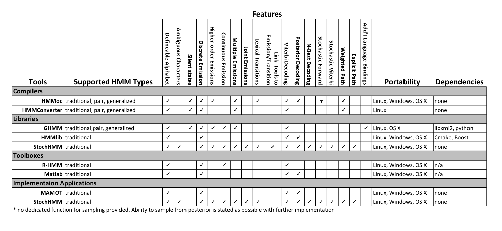

#Comparison of StochHMM with other Compilers, Libraries, Toolboxes, Implementation Applications

I've been asked, how does StochHMM compare to existing HMM solutions and where does it fit in exactly?
 
StochHMM is written and focused on being more accessible and easier to implement HMM's for biologists and bioinformaticians. This comparison focuses on tools that have been published in bioinformatics journals. 

StochHMM isn't the holy grail of HMMs; it focuses on the traditional HMM. I wish I had funding and time to make it the swiss army knife of HMMs(pair,generalized,inhomogeneous), but I don't. When I started on StochHMM I was a wet lab biologist that was frustrated with existing implementation tools. My focus on StochHMM has been to make it easy to implement and understand the model files, flexible so that the models can be adapted to many different situations, accessible to people with minimal bioinformatics skills, and lastly somewhat memory efficient and fast.

To help answer the comparison question, I've compiled a list of HMM utilities, their features, and what StochHMM has or doesn't have.

**Table:** Comparison of features available in existing HMM compilers, libraries, toolkits, and applications. StochHMM is included in both Libraries and Applications because it is provided as both. (Lunter, 2007; Lam and Meyer, 2009b; Schliep et al., 2003; Sand et al., 2010; Schütz and Delorenzi, 2008; Himmelmann, 2010)

You'll notice that StochHMM is listed under Libraries and Implementation Tools.  This is because it is supplied as both.  The implementation tool allows for quick implemenatation and testing of traditional HMM models for programmers and non-programmers alike. The application at it's core is just the Library.  The library allows programmers to extend and adapt the traditional HMM in different ways.

####One of the most common questions that I get from bioinformaticians is: How does it compare to HMMoc? 

First, StochHMM requires a lot less programming knowledge to implement a simple model like the Dishonest Casino model. Researchers can create, run, and quickly adapt a model without ever writing a line of code. Something that isn't possible with HMMoc. This makes it a lot more accessible to non-programmers.  

Second, StochHMM doesn't support pair, generalized HMMs, which are supported in HMMoc. But it does support a lot of features that allows it to be adapted to unique research problems. Many features can be accessed without coding a line of C++. But just a few lines of code in the main function can allow it to call utilities like HMMer from within the Viterbi algorithm, work as a inhomogeneous HMM for classifying parental origin of haplotypes, use user-defined functions as transitions or emissions. Linking function to emissions and transitions isn't supported in HMMoc.

Third, almost everyone is interested in speed and memory efficiency compared to HMMoc. I've ran a simple benchmarks on a 13" MacBook Pro (2.5Ghz Intel Core i5 with 16GB DDR3 memory) using the infamous Dishonest Casino model.  This is a traditional 0th order HMM consisting of 2 interconnected states.  I used a zeroth order model, so R HMM library and Mamot could also include in the comparison.

The programs Mamot, HMMoc, and StochHMM were compiled in Xcode 5.0.1. Memory usage for Mamot, HMMoc-derived programs, and StochHMM were performed using the Instrument's Memory Allocation profiling tool. R was ran using an [R HMM script](dishonest_comp) from the command-line and memory usage was approximated by totaling the memory in displayed by gc(). Time was evaluated using unix time function and all values reported as the average of 10 runs (user+sys) time.   The best values between HMMoc and StochHMM are highlighted in each table.

##Dishonest Casino Benchmark

[Click here to see Dishonest Casino Model files used in benchmark](dishonest_comp)

##Viterbi Algorithm
###Time (seconds): Dishonest Casino HMM on Dice Sequence 

| Sequence Length (bp) |   Mamot  | StochHMM  |  R-HMM   |  HMMoc       |
| -------------------- |:--------:|:---------:|:--------:|:------------:|
| 300                  | 0.00     | 0.00      |  0.25    |  0.00        |
| 3K                   | 0.18     | 0.18      |  21.09   |  **0.11**    |
| 3M                   | 1.78     | 1.90      |   ---    |  **1.11**    |
| 30M                  | 17.92    | 18.15     |   ---    |  **10.83**   |

###Memory (Megabytes): Dishonest Casino HMM on Dice Sequence

| Sequence Length (bp) |   Mamot  | StochHMM      |  R-HMM   |  HMMoc   |
| -------------------- |:--------:|:-------------:|:--------:|:--------:|
| 300                  | 4.60     | 0.08          |  21.00   |  0.07    |
| 300000               | 4.60     | **12.76**     |  79.50   |  32.45   |
| 3000000              | 4.60     | **145.45**    |  444.20  |  300.64  |
| 30000000             | 4.60     | **1360.00**   |  4517.00 |  2300    |

##Posterior Algorithm

###Time (seconds): Dishonest Casino HMM on Dice Sequence

| Sequence Length (bp) |   Mamot  | StochHMM      |  R-HMM   |  HMMoc   |
| -------------------- |:--------:|:-------------:|:--------:|:--------:|
| 300                  | 0.03     | 0.00          |  0.26    |  0.006   |
| 300000               | 0.54     | **0.482**     |  34.66   |  1.452   |
| 3000000              | 5.13     | **4.90**      |   ---    |  15.241  |
| 30000000             | 53.22    | **58.42**     |   ---    |  148.121 |

###Memory (Megabytes): Dishonest Casino HMM on Dice Sequence

| Sequence Length (bp) |   Mamot    | StochHMM  |  R-HMM   |  HMMoc       |
| -------------------- |:----------:|:---------:|:--------:|:------------:|
| 300                  | 48.07      | 0.01      |  21.6    |  0.01        |
| 300000               | 48.07      | 14.55     |  71.4    |  **9.45**    |
| 3000000              | 48.07      | 144.23    |  589.1   |  **94.42**   |
| 30000000             | 48.07      | 1400.00   |    ---   |  **976.15**  |

*Note: Mamot is limited to 300,000bp and must be alphabetic.  If longer sequences are supplied they are split into 300K chunks and ran separately. The sequences were supplied as alphabetic (1=a, 2=b, 3=c, 4=d, 5=e, 6=f)*

*Note: R-HMM was run from the command-line and memory was evaluated using gc() function. Missing values in Processing time were not evaluated.  A single run for these were:  Viterbi 3M (213.20sec), Viterbi 30M (2534.00sec), Posterior 3M (369.68sec) (see RHMM script)*

#Comparison Results & Conclusions

For the Viterbi algorithm, HMMoc is approx **1.7x** faster than StochHMM.  However, StochHMM uses **59%** of the memory that HMMoc used for the Dishonest Casino analysis.  

For the Posterior algorithm, StochHMM is approx **2.5x** faster than HMMoc, while HMMoc uses **69%** of the memory. 

One important component that wasn't taken into account for the benchmark is the **development time** to get the model running. Each of these programs comes with the Dishonest Casino model in one form or another.  So, how long did it take to get them up and running? 

Under OS X Mavericks, Mamot wouldn't compile without fixing some minor things. Must prefix all of the many "cout,cerr,and endl" with std:: .  On Centos 5.1, it compiles just fine. So, depending on what system you are compiling on, you may need to spend a few minutes fixing the code. Import of the sequence and writing results are handled completely.

On the other hand, HMMoc require development time.  HMMoc generates the HMM C++ code, but then the programming begins. You'll need a function to import the sequence and then call the appropriate HMM functions and output the processed data. Based on the example code provided in HMMoc, I copied what I needed and wrote a very quick and ugly fasta import function.  I used the print function that was supplied in the original example, but piped the results to a file.  In total, I spent 30 minutes getting it up and running. 

However, if you are writing your own model expect to spend a lot more time working through the examples. Mamot has a very simple format that appears easy to write and understand.  HMMoc will take a little while 
to figure out what the XML model template code is doing and making sure that you have the correct XML formatting.  Documentation for both of these utilities aren't extensive, so look at the examples.

I've tried to document StochHMM's model format extensively and I am working on improving the amount of detail and examples.

If you have any question or comments, please feel free to contact me.  

1. Lunter,G. (2007) HMMoC--a compiler for hidden Markov models. BIOINFORMATICS, 23, 2485–2487.
2. Lam,T.Y. and Meyer,I.M. (2009b) HMMCONVERTER 1.0: a toolbox for hidden Markov models. Nucleic Acids Res, 37, e139–e139.
3. Schliep,A. et al. (2003) Using hidden Markov models to analyze gene expression time course data. BIOINFORMATICS, 19 Suppl 1, i255–63.
4. Sand,A. et al. (2010) HMMlib: A C++ Library for General Hidden Markov Models Exploiting Modern CPUs. CORD Conference Proceedings, 126–134.
5. Schütz,F. and Delorenzi,M. (2008) MAMOT: hidden Markov modeling tool. BIOINFORMATICS, 24, 1399–1400.
6. Himmelmann, L. (2010) R Package "HMM". http://cran.r-project.org/web/packages/HMM/HMM.pdf
      